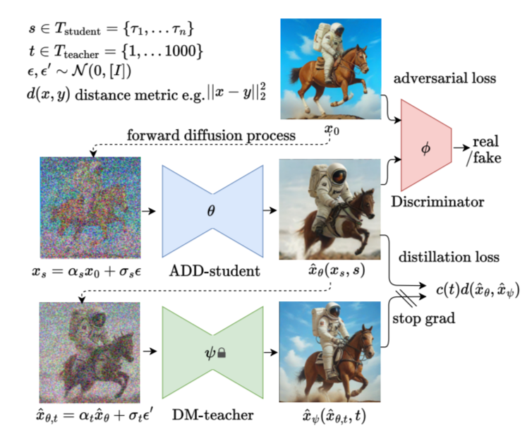

# **[SDXL Turbo](https://ja.stability.ai/blog/sdxl-turbo)**
[read paper](https://static1.squarespace.com/static/6213c340453c3f502425776e/t/65663480a92fba51d0e1023f/1701197769659/adversarial_diffusion_distillation.pdf)  

# **Architecture**

  
Adversarial Diffusion Distillationから引用:https://ja.stability.ai/blog/sdxl-turbo

- SDXL-TurboはSDXL(Stable Diffusion XL)を知識蒸留によって軽量化したモデルである。ADD(Adversarial Diffusion Distillation)という蒸留手法を利用している。ADDはGAN(Generative Adversarial Network)と同様な手法をDistillationに適用した蒸留手法である。学習可能なパラメータを持つ生徒モデルのADD Student、同じく学習可能なreal/fakeの識別を行うDiscriminatorを、相互に敵対させながら学習していく。DM Teacherはパラメータを固定した事前学習済みのDiffusion Modelである。
- 学習のプロセスを説明する。はじめに正解画像からノイズ画像を生成し、ADD Studentによって画像生成を行う。次に生成された画像からノイズ画像を生成し、これを入力としてDM Teacherによって画像生成を行う。正解画像とADD Student生成画像からAdversarial lossを計算することでDiscriminatorのパラメータを更新し、ADD Student生成画像とDM Teacher生成画像のdistillation lossからADD Studentのパラメータを更新する。訓練を進めるにつれて、ADD StudentはDiscriminaterを騙せるようにより高精度のフェイク画像を生成するようになり、反対にDiscriminaterは騙されないように高精度の判別を行うようになる。